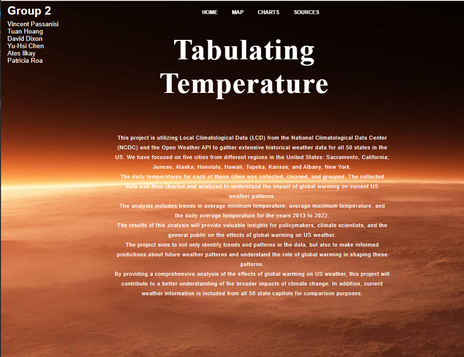
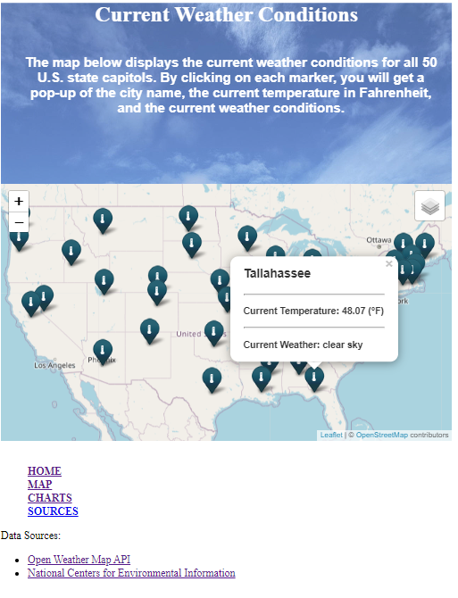
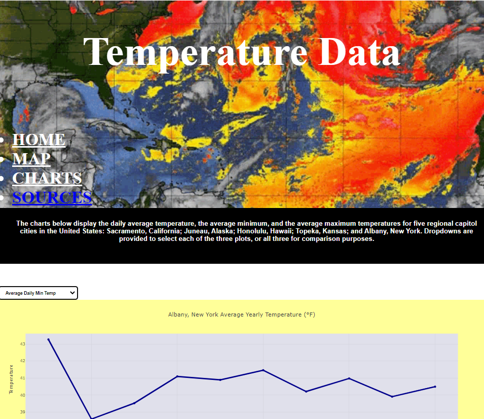

# Weather-Project-3

### Members:
Yu-hsi Chen \
Tuan Hoang \
David Dixon \
Vincent Passanisi \
Ilkay Ates\
Patricia Roa

## Project Description:
This project will utilize data from the National Oceanic and Atmospheric Administration (NOAA) to gather extensive historical weather data for several states in the US. The collected data will be analyzed to understand the impact of global warming on US weather patterns. The analysis will include trends in daily average, maximum, and minimum temperature. The results of this analysis will be used to make informed predictions about future weather patterns and to understand the role of global warming in shaping US weather patterns. The project will provide valuable insights for policymakers, climate scientists, and the general public on the effects of global warming on US weather.

## Questions to ask:
1. Does historical weather data confirm or disaffirm global warming?
2. How do weather patterns across the US help us answer this question?

## Potential Data Sources:
1. LCD Documentation from NOAA:
   https://www.ncei.noaa.gov/data/local-climatological-data/doc/LCD_documentation.pdf

2. NOAA Climate Data:
   https://www.ncei.noaa.gov/cdo-web/

3. OpenWeather API:
   https://openweathermap.org/

4. AniJS:
   https://anijs.github.io/

5. Leaflet:
   https://leafletjs.com/

6. D3:
   https://d3js.org/

IMAGE SOURCES:

7. Home Page Background:
   https://wallpapers.com/wallpapers/burning-temperature-of-the-sun-b14hsxx2jppt7gua.html

8. Charts Page Header:
   https://tenor.com/view/weather-wind-weather-forecast-gif-17384272

## Data Analysis
Our analysis surprisingly showed cooling temperatures for the period studied. It should be noted that the time period analyzed was relatively short, and for a limited number of cities in the United States. A more robust analysis would include historical meteorological data for a much longer time period and for cities and regions around the world.
With the exception of one city, Honolulu, Hawaii, the cities we chose all displayed a cooling trend over the period 2013 to 2022. For Albany, New York, temperatures in the past decade have slightly decreased from the base year 2013, where the average temperature for the year was 53.4 ℉ and dropped to 50.9 ℉ in 2022. The average minimum temperature dropped significantly from 2013 to 2014, but then remained relatively stable at 40 ℉ through the rest of the decade. Average maximum temperature climbed in 2022 from 58 ℉ to almost 61 ℉. One would presuppose that warming trends would be most evident in Alaska with its proximity to the North Pole, especially since the shrinkage of arctic ice is well-documented; however, the temperature data for the past decade is inconclusive. There is quite a bit of volatility over the past ten years, and the average daily temperature did rise from 2014 to 2015 by about a degree-and-a-half. It remained at that level through 2014 but then dropped over 3.5 ℉ in 2017. Despite the variability, the mean temperature for the decade remained relatively unchanged. Average minimum temperature in 2022 was less than a degree Fahrenheit lower than it was in 2013. Temperatures in Sacramento, California show a marked drop from 2013 to 2018, until they rise again to within a degree of the base year of 2013. In 2020, average temperature reached almost 64 ℉, but then fell again the next year. Both minimum and maximum average temperatures fell nearly 3 ℉ from the base year to 2022. Like Juneau, Topeka shows more variability than the other cities, but over the course of the decade showed a drop of just over 2 ℉. Similar to Sacramento, there was a precipitous drop in the average temperature in the first year of data. Average temperature dropped in that year from almost 59 ℉ to just over 55 ℉. Minimum average temperature dropped from 47.5 ℉ to 44.2 ℉ over the course of the decade. The trend for the decade overall is one of cooling, but longer time spans will need to be analyzed to see if this is an anomaly or part of a longer-term trend.
Of the five cities we examined, the one outlier was Honolulu, Hawaii. It was the only city that showed a warming trend over the course of the past decade. All our data sets showed a warming trend of a little less than 0.5 ℉. Average daily temperature rose from 77.98 ℉ to 78.38 ℉. Average maximum temperature rose from 84.28 ℉ to 84.73 ℉. And average minimum temperature rose from 71.22 ℉ to 71.51 ℉. All data showed a marked increase starting in 2016 through 2019. Average temperatures in that period rose a degree-and-a-half. Temperature began falling again in the last three years of the decade, but never reached their 2013 base year level.

## Issues/Limitations:
While we had access to weather data of all US states that date as far back as the 1940s, the raw data itself was too large to manage. As a result, we chose to limit our research to five US weather stations and observed that four out of our five state capitals experienced a decrease in temperature within the last ten years. Had we gathered data from further back, perhaps our analysis would have told a different story. With more time, we would have analyzed other factors such as precipitation, cloud cover, wind patterns, and humidity. In addition, a regression analysis would have more clearly shown the trends in the data. We could have also seen if there was any correlation between the different measurements.

### Breakdown of Tasks:
1. Research potential data sources
2. Clean and organize data
3. Create databases
4. Build charts
5. Build dashboard